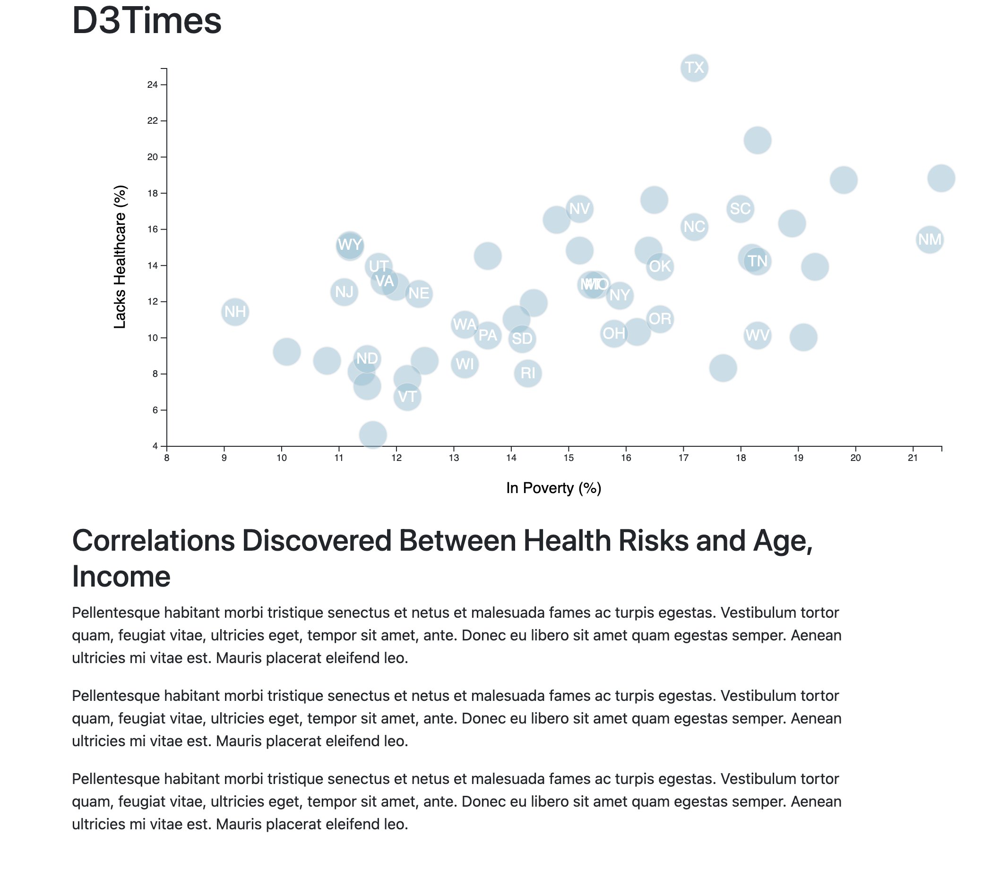

## Summary

Using a [dataset](assets/data/data.csv) based on 2014 ACS 1-year estimates from the [US Census Bureau](https://data.census.gov/cedsci/), the goal is to create a scatter plot using D3. The current data set includes data on rates of income, obesity, poverty, etc. by state. MOE stands for "margin of error."

## Scope

I chose to create a scatter plot between the two data variables: Healthcare vs. Poverty.

I used D3 technique to create a scatter plot that represents each state with circle elements. I used the 'd3.csv' in my JavaScript file to grab the data, and used it to create my plot, wit the state abbreviations are within the circles.

### Note
You'll need to use `python -m http.server` to run the visualization. This will host the page at `localhost:8000` in your web browser.
